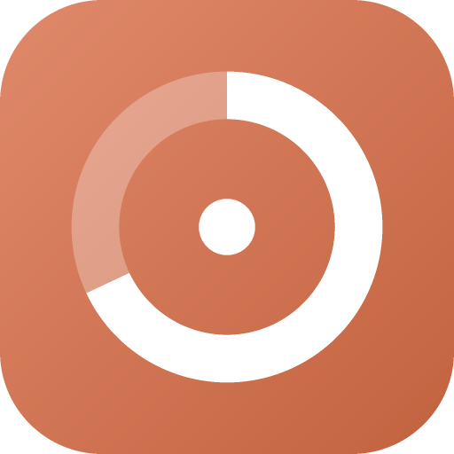

# TokenMeter

Medidor de uso de tokens na bandeja do sistema — Windows, macOS e Linux.
Lê os transcripts locais da CLI e mostra quanto você consumiu na janela de
5 horas, na semana e no dia.



## Instalar

Baixe o instalador em [Releases](../../releases) e execute. O app fica na
bandeja; não abre janela na barra de tarefas.

Ou rode a partir do código:

```bash
npm install
npm start
```

## O que ele mede, e o que ele não mede

**Fonte de dados:** os transcripts em `~/.claude/projects/**/*.jsonl` (ou
`$CLAUDE_CONFIG_DIR/projects`). Esses dois nomes são fixados pela CLI e são as
únicas strings do projeto que não podem ser renomeadas sem quebrar a coleta.
Cada mensagem do assistente traz o bloco `usage` completo — tokens de entrada,
saída, escrita e leitura de cache — com timestamp e modelo. Nada sai da sua
máquina: o app não faz nenhuma chamada de rede.

**Leia isto antes de confiar na porcentagem.** Os limites reais da assinatura
vivem no servidor e **não existem em disco**, então este app não consegue lê-los.
O que ele faz é estimar: precifica cada registro pelas tarifas da API e compara
esse "valor equivalente consumido" com um orçamento por plano.

### Calibração automática

O orçamento se corrige sozinho, a partir de uma inferência que não precisa de
credencial nenhuma:

> Se uma janela de 5h terminou com X consumido e você **não** foi bloqueado,
> então o limite real é no mínimo X.

Ou seja, o seu próprio histórico prova um piso para o limite. O app calcula o
maior bloco de 5h já completado e a maior janela de 7 dias já ocorrida, e eleva
o orçamento até lá quando o padrão do plano é menor. Isso **só aumenta** — nunca
inventa um limite menor do que já aconteceu, porque isso seria matematicamente
impossível.

O efeito é que escolher o plano errado deixa de importar muito: com o padrão do
Pro num histórico pesado a leitura ia a 492%, e a calibração automática traz
para 45% sem nenhuma intervenção.

O que ela **não** consegue é achar o teto. Ela converge para o limite por baixo,
então enquanto você nunca chegou perto do limite, o orçamento fica conservador e
a porcentagem lida um pouco alta. Para cravar o número exato, use a calibração
manual abaixo.

### Na prática

- A porcentagem é **estimativa**. Para cravar: **Configurações → Plano →
  Calibrar na mão** — digite a porcentagem que o app oficial está mostrando e o
  orçamento se reajusta para bater com ela. A automática continua valendo como
  piso, porque um piso comprovado nunca pode estar errado.
- Só conta uso da **CLI**. Conversas na web ou no app desktop não aparecem,
  porque não geram transcript local.
- Os valores em dólar são **equivalência de API**, não o que você paga. Numa
  assinatura você paga a mensalidade; o número serve para comparar intensidade
  de uso entre dias, modelos e projetos.

Os tokens absolutos, esses, são exatos — vêm direto do que a API reportou.

## Os três modos de exibição

| Modo | O que é |
|---|---|
| **Badge na bandeja** | O ícone é desenhado a cada atualização: anel, barra ou ponto, com o número dentro. Verde → âmbar → vermelho conforme os limiares. |
| **Overlay flutuante** | Janelinha sem borda, sempre acima das outras, arrastável. Tem modo compacto (uma linha) e opção de ignorar cliques. |
| **Painel** | Clique no ícone da bandeja: medidores de 5h e semana, totais do dia, quebra por modelo e por projeto, e histórico de 14 dias. |

## Janelas de tempo

- **Sessão de 5h** — o bloco abre na sua primeira mensagem (arredondada para
  baixo na hora) e dura cinco horas. A mensagem seguinte ao fechamento abre um
  bloco novo.
- **Semana** — por padrão os últimos 7 dias corridos; dá para trocar para reset
  fixo escolhendo dia da semana e hora.
- **Hoje** — dia do calendário local.

## Configuração

Tudo em Configurações (engrenagem no painel, ou menu de contexto da bandeja).
Persiste em `settings.json` no `userData` do app.

- **Plano** — Pro, Max 5x, Max 20x ou orçamento personalizado.
- **Calibrar** — o ajuste que faz a estimativa bater com o número real.
- **Badge mostra** — sessão, semana, hoje, ou o maior dos dois.
- **Cores de alerta** — em que porcentagem vira âmbar e vermelho.
- **Iniciar com o sistema**.

## Como ele fica rápido

Transcripts são append-only, então o leitor guarda o offset em bytes de cada
arquivo e só parseia o que foi acrescentado. Com 18 transcripts e ~2.400
registros: **309 ms** na varredura inicial, **3 ms** nas seguintes. Além do
timer, um `fs.watch` recursivo dispara atualização quase imediata quando um
transcript muda.

## Desenvolvimento

```bash
npm run preview   # renderiza a UI real no navegador com seus dados, sem Electron
npm run icon      # regenera assets/icon.png (encoder PNG proprio, sem dependencias)
npm run dist:win  # instalador NSIS em release/
```

O `preview` existe porque iterar CSS dentro do Electron é lento: ele copia o CSS
e os scripts que realmente são publicados, injeta um `window.usage` falso com o
resumo dos seus transcripts e abre em `preview/out/index.html`.

## Estrutura

```
src/main/
  index.js      ciclo de vida, bandeja, janelas, IPC
  reader.js     varredura incremental dos JSONL
  aggregate.js  janelas de 5h/dia/semana, agrupamentos
  pricing.js    tarifas por modelo e multiplicadores de cache
  plans.js      orcamentos por plano e matematica da calibracao
  badge.js      rasteriza o icone da bandeja
  store.js      settings.json
  paths.js      onde ficam os transcripts
src/preload/api.js   unica ponte entre UI e main
src/renderer/        popup, overlay, configuracoes, badge
```

As janelas rodam com `contextIsolation` ligado, sem Node, e com CSP — a
superfície exposta à UI é exatamente o que está em `src/preload/api.js`.

## Licença

MIT
